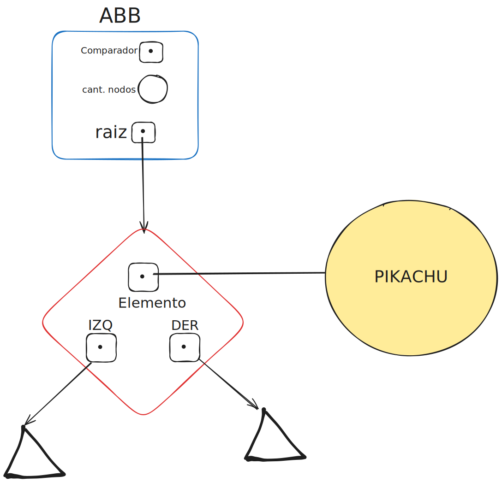
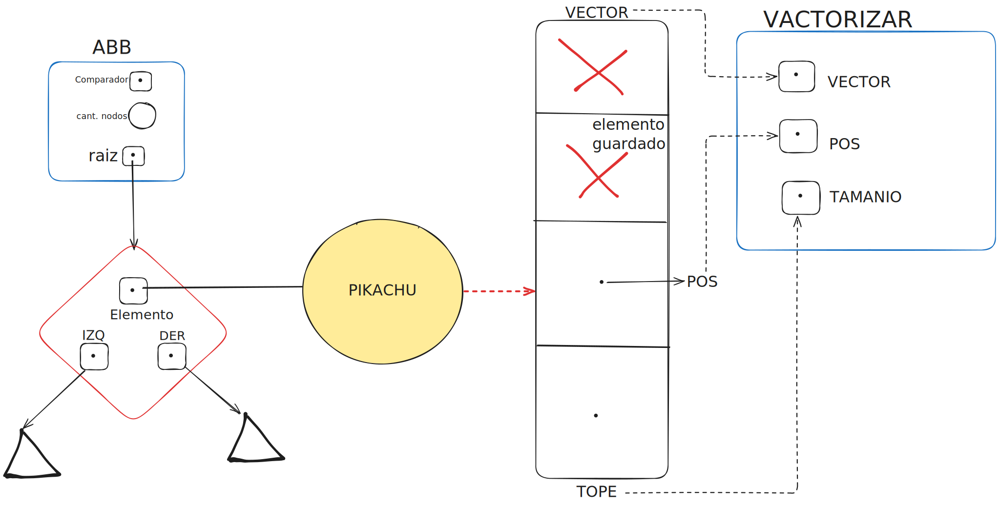
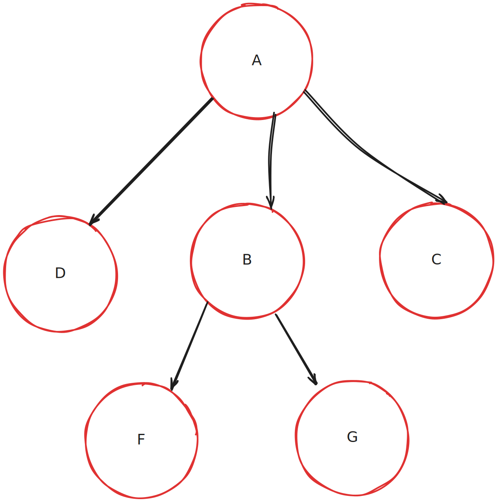
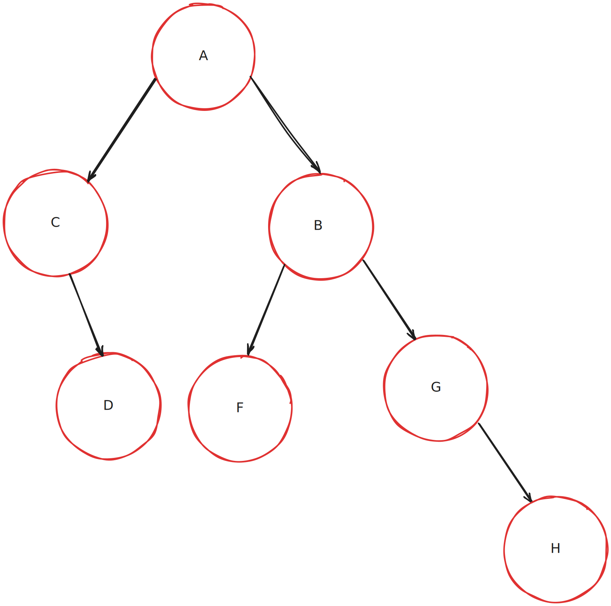

<div align="right">

</div>

# TDA ABB


## Alumno: Nicolas Martin Guerrero - (112514) - guerreronico81@gmail.com

- Para compilar:

```bash
gcc tp_abb.c src/*.c
```

- Para ejecutar:

```bash
./a/out pokedex.csv
```

- Para ejecutar con valgrind:
```bash
valgrind ./a/out pokedex.csv
```

---

##  Funcionamiento

La estructura de cada nodo del ABB tiene 3 punteros: uno al elemento que guarda y los otros dos apuntan a un hijo cada uno. Esto permite tener un ABB que almacena cualquier tipo de dato, pero es necesario tener una forma de comparar los datos almacenados. Para lograr esta comparación, se requiere una función comparadora que se almacena en la estructura del ABB, que tiene un puntero a esa función comparadora, un puntero al primer nodo del ABB (la raíz) y un `int` que indica la cantidad de nodos que se encuentran en el árbol.
<div align="center">

</div>

Mi ABB utiliza funciones auxiliares, que son recursivas, para moverse entre los nodos del ABB y realizar la tarea necesaria dependiendo de la función, ya sea iterar o buscar. En el caso de la función de eliminar, cuando se encuentra un nodo con 2 hijos, la búsqueda de su predecesor inorden se realiza con un while, ya que la posición del predecesor ya es conocida y cumple con ciertos requisitos, como que no tenga hijos y que sea el nodo más a la derecha de la rama izquierda del nodo a eliminar.

Por el diseño de los árboles, la recursividad es una herramienta muy útil, especialmente para iterar, por eso usé recursividad en casi todos los casos. La única excepción es la búsqueda del predecesor inorden cuando quiero quitar un nodo con 2 hijos. En este caso, la iteración me permite ignorar las reglas del ABB para moverme; es decir, al iterar en una dirección en concreto, no me interesa comparar el elemento que busco con el actual para elegir una dirección. Esto es algo que hace muy bien la recursividad y es el motivo por el cual la inserción de elementos funciona correctamente.

Las 2 funciones que más problemas causaron fueron las de iterar y vectorizar, no por tener diferentes órdenes, sino por contabilizar correctamente la cantidad de iteraciones realizadas en el caso de iterar. Obtener la cantidad de iteraciones cuando la función pasada como parámetro daba true no era problema alguno; la dificultad está en sumar cuando esta función devolvía false. Cuando F devuelve false, hay que sumar 1 y cortar las recursiones, y la manera de cortar las recursiones que ya se llamaron pero que no sumaron todavía es con un `bool*` que indique cuándo continuar y cuándo no continuar.

En las funciones de vectorizar parecía fácil al inicio, ya que el orden está dado por las funciones de iterar; entonces, solo tenía que hacer una función que vectorice el elemento de un nodo. El problema del que no me percaté al planificar esta función es que la función que vectoriza tenía que cumplir con bool `(*f)(void *, void *)`, por lo que debía tener esta forma:` bool llenar_vector(void *elemento, void *ctx)`. Para pasarle la información necesaria para manejar el vector, esta información debe entrar en un `void*`, y con ese propósito usé un struct. Originalmente pensé en pasar un vector de `void**` que tuviera en la primera posición el vector en donde guardar los elementos, en la segunda posición el tope del vector en donde guardar los elementos y en la tercera en qué posición del vector guardar el elemento. Sin embargo, después de investigar (YouTube y el canal de Discord), encontré que era más fácil si usaba un struct.

```c
struct vectorizar {
	void **vector;
	size_t pos;
	size_t tamanio;
};
```



---

## Respuestas a las preguntas teóricas

-   Explique teóricamente (y utilizando gráficos) qué es una árbol, árbol
    binario y árbol binario de búsqueda. Explique cómo funcionan, cuáles son sus
    operaciones básicas (incluyendo el análisis de complejidad de cada una de
    ellas) y por qué es importante la distinción de cada uno de estos diferentes
    tipos de árboles. Ayúdese con diagramas para explicar.

Un Arbol es una coleccion de nodos con orden jerarquico. Los nodos son los elementos o vertices del  ́arbol que apuntan a otros nodos, conocidos como sus hijos y cada hijo puede tener su propio conjunto de hijos. El nodo principal se llama raíz, y todos los demás nodos se derivan de él, organizándose en niveles. Un  ́arbol puede ser definido de varias formas. Una forma natural es hacerlo en forma recursiva. 
<div align="center">	
 
</div>

El Arbol binario es un tipo de Arbol, osea que comparte su naturaleza jeraquica, sus niveles, la forma de ser definido, pero la diferencia caracteristica es que los nodos estan limitados a tener solo 2 hijos. Los Arboles Binarios estan  ́ıntimamente relacionados con las operaciones de busqueda. Cuando se realiza una busqueda se necesita saber para que lado se debe continuar, si a la derecha o a la izquierda.
<div align="center">	
 
</div>
El Arbol Binario de Busqueda es un tipo de Arbol binario, es caracterizado por tener reglas que todos los nodos deben cumplir, por ejemplo, todos los valores del subárbol izquierdo son menores que el valor del nodo, y todos los valores del subárbol derecho son mayores. Tener estas reglas facilitan la busqueda de nodos en el arbol.


Los 3 tipos de Arboles comparten operaciones, que son:

* crear
* destruir
* vacio
* insertar
* eliminar
* buscar
* recorrer

`A=Arbol,AB=Arbol Binario,ABB=Arbol Binario de Busqueda`

complejidad de crear: A=O(1),AB=O(1),ABB=O(1)

complejidad de destruir: A=O(n),AB=O(n),ABB=O(n)

complejidad de vacio: A=O(1),AB=O(1),ABB=O(1)

complejidad de insertar: A=O(1),AB=O(n),ABB=O(n)

complejidad de eliminar: A=O(n),AB=O(n),ABB=O(n)

complejidad de buscar: A=O(n),AB=O(n),ABB=O(n)

complejidad de recorrer: A=O(n),AB=O(n),ABB=O(n)

El pero caso para un ABB es cuando esta muy desbalanceado, pero cuando el ABB esta balanceado varias operaciones(insertar,eliminar,buscar) pasan a ser O(log n)

Distinguir a los tipos de arboles es importante ya que cada Arbol tiene un propocito diferente, el Arbol permite tener cualquier cantidad de nodos hijos, el Arbol binario se limita a tener solo 2 hijos para faciltar el recorrido pero no tiene orden, y el Arbol Binario de Busqueda se limita a tener 2 hijos pero tienen que cumplir reglas para mantener el orden que facilita las operaciones.
Osea que el Arbol base es mas general pero lento, el Arbol Binario es mas rapido pero limta su jerarquia, y el Arbol Binario de Busqueda es todavia mas rapido pero ademas limita a sus nodos a cumplir ciertas reglas.

--   Explique la implementación de ABB realizada y las decisiones de diseño
    tomadas (por ejemplo, si tal o cuál funciones fue planteada de forma
    recursiva, iterativa o mixta y por qué, que dificultades encontró al manejar
    los nodos y punteros, reservar y liberar memoria, etc).


Fue explicado previamente. Pero de manera resumida, decidi usar funciones recusivas siempre que sea posible porque es lo convencional con un ABB. Para recorrer el ABB en cualquier funcion que requiere una busqueda, uso el comparador para saber en que direccion dirigirme y no encontre ningun problema con el manejo de memoria, sino con la contavilizacion de iteraciones, vectorizar y con quitar sin gurdar el elemento quitado en un puntero(error mio por no entender bien la definicion de quitar, pero las pruebas que usan quitar sin guardar el puntero no lo informan).
